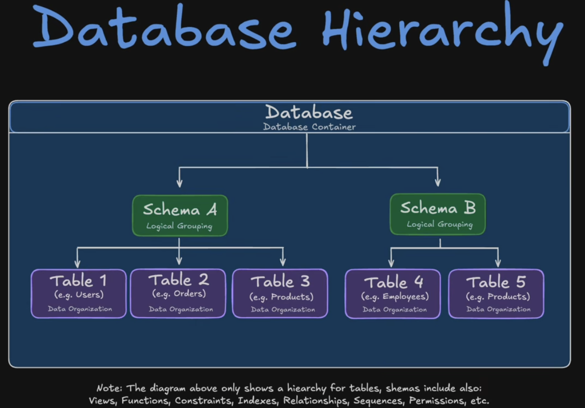

## Writing Product Level Code : 
### Transactions, TRY & CATCH, ROLLBACKS and THROW

**Transactions**= "Group these operations into one atomic unit" 
- It ensures an all or nothing execution. Either every statement inside the commit executes or none do. This prevents one error in the code from producing downstread errors. E.g. if your code block creates a table, and then populates it, but there is a problem with inputting the data then the table will also not be created to avoid duplication errors. 
- However, transaction will only stop the execution of the code block, it will not do anything about it. 

**Try Catch Block**
- If something doesn't work then the TRY Catch block will do something about it. 

**ROLEBACK**:
- Rollback will undo everything the transaction has done so far. 

```sql
BEGIN TRANSACTION;
      INSERT INTO staging.priority_roles VALUES (1, 'Data Engineer', 2);  -- ✅
  runs
      INSERT INTO staging.priority_roles VALUES (1, 'Duplicate!', 3);     -- ❌
  fails (duplicate key)
      -- Without ROLLBACK, that first INSERT is in limbo

```

- When you call ROLLBACK in the CATCH Block it will reverse the first insert too. 

**THROW**
- Throw is responsible for bubbling up the error that happend so it is apparent. without it the code will not execute when there is an error sure, but no one will know what happened

```sql
BEGIN CATCH
    ROLLBACK; -- error is swallowed 
END CATCH;

BEGIN CATCH
    ROLLBACK; -- undoes everything
    THROW; -- then surface the error message to the caller 
END CATCH;
```


**How They Work Together**

TRY...CATCH     →  "Monitor for errors"
TRANSACTION   →  "Group these as one unit"
COMMIT        →  "All good? Make it permanent"
CATCH           →  "Something broke?"
ROLLBACK      →  "Undo everything"
THROW         →  "Tell someone about it"


# Creating Priority_jobs_snapshot pipeline expalined: ETL pipeline to create a datawarehouse

**This tutorial is Circular**

- Because the underlying job_postings_fact table never actually receives new data between runs, the temp table and target will always be identical
after the initial load. The tutorial is teaching you the pattern assuming you'd plug in a real, changing data source.

- In production, something upstream (an API ingestion script, a Kafka consumer, a file drop) would be continuously feeding new rows into
job_postings_fact — that's the part this tutorial skips over.


### Day 0 : 
- job_postings_fact has 1.62 million job postings. You run the inital load script, which creates and populates the priority_jobs_snapshot table in the main schema of job_mart database

### Day 1: 
Overnight three things happen:
1. 50 new job postings lan in job_positngs_fact (from a job board API, a CSV upload a streaming pipeline etc.)
2. 10 existing postings get removed from job_postings_fact (jobs were filled / expired)
3. 1 business decision: "Software Engineer" priority changes from 3 to 1 in staging.priority_roles

### [**Batch Load Runs**]

The batch script creates the temp table by querying the **current state** of the source tables: 

- src_priority_jobs (temp, built fresh)
    - Has the 50 NEW job postings 
    - Missing the 10 removed postings 
    - Software Engineer priority = 1 
- priority_jobs_snapshot (target, yesterday's data)
    - Does not yet have the 50 new job postings 
    - still has the 10 removed postings
    - Software Engineer priority = 3 (outdated)

### Version 1

Now in Version 1 of the batch load process 

1. We create a temporary source table, which combines data_jobs.job_postings_flat, data_jobs.company_dim and job_mart.staging.priority_roles

2. We batch process the job_mart.priority_jobs_snapshot table via three commands: 

| Operation | What it catches | Example |
|-----------|-----------------|---------|
| **Update** | Same job_id exists in both, but values differ | Priority level changed from 3 -> 1 |
| **INSERT** | job_id in source but NOT in target | The 50 new postings |
| **DELETE** | job_id in target but NOT in source | The 10 removed postings |

After this batch run, the target snapshot matches the current reality. 


### Version 2: 

1. We create a temporary source table, which combines data_jobs.job_postings_flat, data_jobs.company_dim and job_mart.staging.priority_roles

2. MERGE INTO to UPDATE INSERT AND DELETE 

```sql

MERGE INTO target_table AS tgt
USING source_table AS src
ON tgt.id = src.id -- The keys that join both table, since both tables are the same (one is the updated version and one is the previous this the joining id would be the same)

-- UPDATE
WHEN MATCHED 
    UPDATE SET
        tgt.update_column = src.update_column,
        ....
-- INSERT :
WHEN NOT MATCHED BY TARGET
    INSERT (
        tgt.column1,
        tgt.column2,
        tgt.column3
    )
    VALUES (
        src.column1,
        src.column2,
        src.column3
    )

-- DETELE
WHEN NOT MATCHED BY SOURCE THEN
    DELETE;

```


# Data Modelling

### Database Hierachy



- The database container has : 
    1. Schemas which contain: 
        1. Tables
        2. Views
        3. Functions
        4. Constraints
        5. Indexes
        6. Relationship
        7. Sequences
        8. Permissions

### ERD Diagram (Entity Relationship Diagram)


An ERD shows what tables exist, what columns they have, and how they connect. Three things to read:

1. Tables (the boxes)

Each box is a table. You have four:
- job_postings_fact — the central fact table (the raw
events/transactions)
- company_dim — dimension table (descriptive info about
companies)
- skills_dim — dimension table (descriptive info about skills)
- skills_job_dim — a bridge/junction table that links jobs to skills (because one job can require many skills, and one skill appears in many jobs)

2. Keys (PK and FK)

- PK (Primary Key) — uniquely identifies each row in that table (e.g. job_id in job_postings_fact)
- FK (Foreign Key) — a column that points to a PK in another table (e.g. company_id in job_postings_fact points to company_id in company_dim)
- PK/FK — both at once. In skills_job_dim, job_id and skill_id together form the PK, and each individually is an FK pointing to  the other tables

3. Lines (the relationships)

The lines between tables show JOINs. Reading your diagram:

job_postings_fact.company_id  →  company_dim.company_id
(many jobs → one company)
job_postings_fact.job_id      →  skills_job_dim.job_id
(one job → many skills)
skills_dim.skill_id           →  skills_job_dim.skill_id
(one skill → many jobs)


Why This Matters

This is a star schema — the standard data warehouse pattern:
- Fact table in the centre (job_postings_fact) holds the
measurable data (salaries, dates)
- Dimension tables around it (company_dim, skills_dim) hold the descriptive context
- Bridge table (skills_job_dim) handles the many-to-many
relationship between jobs and skills

### Why Data Modelling Matters : 

- Let's we get the raw job postings data from multiple sources: LinkedIn, Indeed and Glassdoor
- Each source will have thier own database and method of storing that data as shown: 


- Data modelling helps with this by bringing in structure and consistency

## Source To Analysis 

- Source System : 
    - CRM 
    - ERP (Enteprise Resource Planning)
    - App Backend
    - Normalised Tables
- Extract 
```sql
COPY *
FROM 
source
```
- Load
```sql
INSERT
INTO
    target
FROM
    staging
```
- Transform
```sql
SELECT
*
FROM 
raw
WHERE
condition
```
- Analytical System (typicall OLAP): 
    - Data Warehouse
    - Data Mar
    - Data Lakehouse


### Types of Source Systems : Enteprise Resource Planning

- Runs the entire business
- Core Modules: 
    - Finance, 
    - Supply Chain : Inventory, Procurement
    - Manufacturing
    - HR : payroll ,benifits
- Data Role : System of record for operational truth
- Question it Answers : "How is the business running internally?"
- Example : Odoo

### Types of Source Systems : Customer Relationship Mangement

- **Purpose**: Grow Revenue 
- **Focus** : Front office operation
- **Core Modules:**:
    - Sales : leads, oppertunities, pipelines
    - Marketing : campaings, attribution
    - Support : tickets, customer sucess
- **Question it answers :** "How do we acquire, convert and retain customers?"
- Examples: Salesforce, hubspot

- All source systems store their data in database, e.g. Odoo uses Postgres, Salesforce use Oracle


## Choosing a Database: OLTP Vs OLAP

- There are two main types of relationship databased we can have : 

| Layer | Purpose | Optamised For | Structure |
| -----| ---------| ------------- | ---------- |
| OLTP - Online Transaction Processing | Operate apps and capture live transactions | High-velocity data - constant incoming data being written to the database, has low latency | Many narrow related tables, strict Foreign Keys |
| OLAP - Online Analytical Processing | Analyse historical data and report | Large Scans, aggregations, filters, time-series | Fact Tables (measures) + Dimension Tables (who/what/when/where) | 


## Core Design Patterns 

### Star Schema
